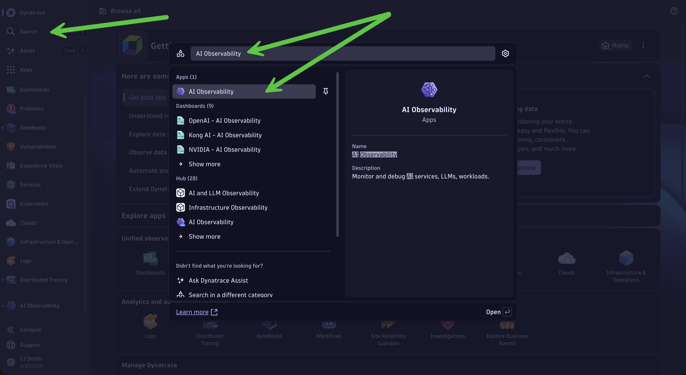
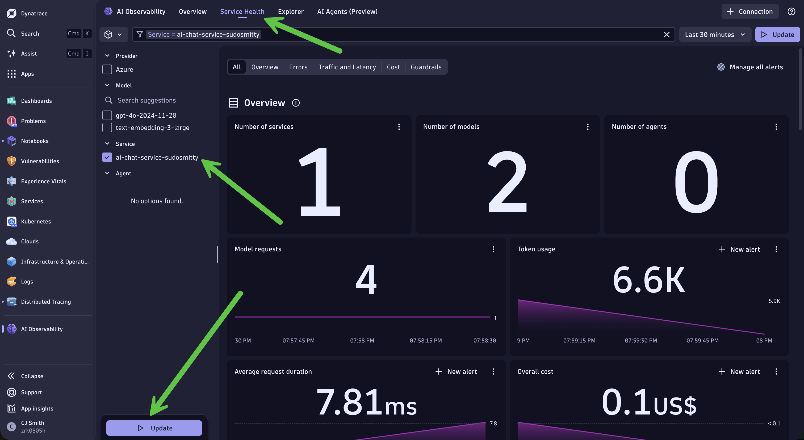
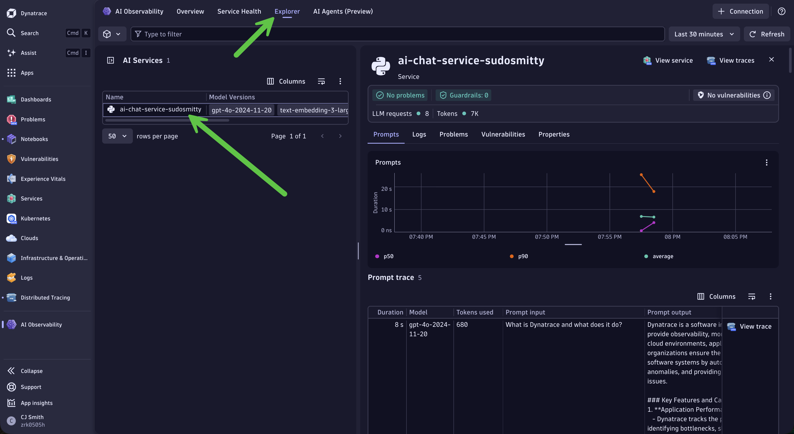
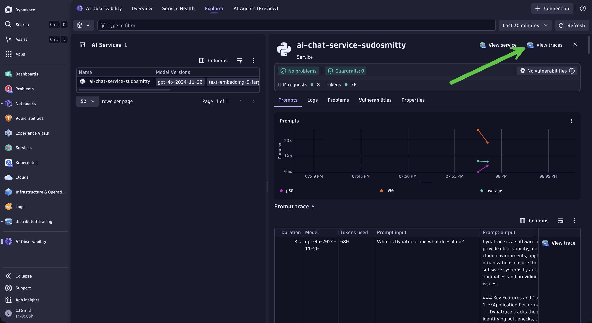
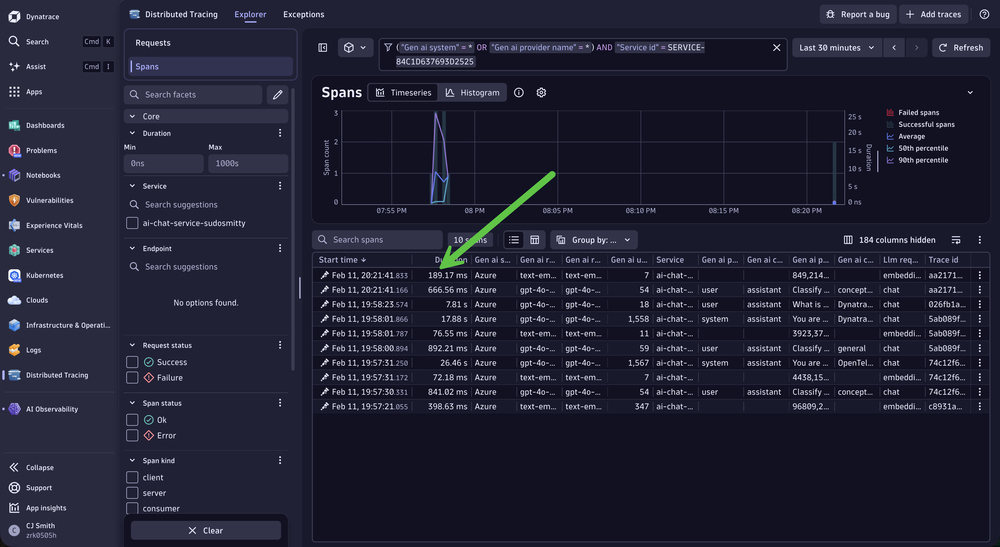
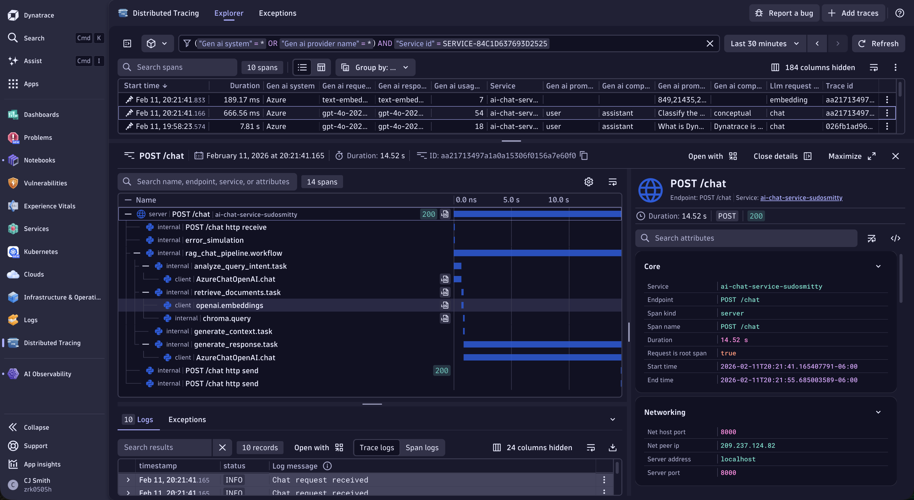

# Lab 2: Exploring AI Traces in Dynatrace

**Duration:** ~30 minutes

In this lab, you will explore the traces generated by your AI application and use Dynatrace to understand the behaviour, performance, token usage, and estimated cost of the RAG pipeline.

## Learning Objectives

By the end of this lab, you will be able to:

- Navigate from the AI Observability app to distributed traces
- Analyse LLM calls, prompts, completions, and token usage
- Explore the main stages of a RAG pipeline
- Compare token consumption with the model's limits
- Estimate model costs using a Grail lookup table
- Identify opportunities to improve prompt efficiency
- Analyse token usage over time with DQL

<div class="why-dynatrace" markdown="1">

## Why Dynatrace for AI Observability?

| Capability | Basic tracing | Dynatrace |
|---|---|---|
| Collect traces | OpenTelemetry | Native OTLP and OpenLLMetry |
| Inspect token usage | Span attributes | Unified with service and cost analysis |
| Correlate application behaviour | Manual | Connected traces, logs, and service context |
| Investigate failures | Manual investigation | End-to-end trace and log analysis |
| Detect anomalies | Static thresholds | AI-powered baselines |
| Take action | External tooling | Built-in Workflows |

</div>

---

## Step 1: Access Dynatrace

### 1.1 Open Dynatrace

Open the Dynatrace environment URL provided by your instructor:

```text
https://YOUR_ENV.apps.dynatrace.com
```

### 1.2 Sign in

Use the credentials provided by your instructor.

---

## Step 2: Find Your AI Service

### 2.1 Open the AI Observability app

1. Open **Search** in Dynatrace.
2. Search for **AI Observability**.
3. Select the app from the results.



### 2.2 Explore service health

1. Select **Service Health** at the top of the app.
2. Select `ai-chat-service-{YOUR_ATTENDEE_ID}`.
3. Select **Update**.



The explorer view provides an overview of traffic, latency, errors, token usage, and other available AI observability data.

---

## Step 3: Explore Prompt and Trace Data

### 3.1 Explore AI requests

1. Select **Explorer** at the top of the AI Observability app.
2. Select `ai-chat-service-{YOUR_ATTENDEE_ID}`.

This view provides more detailed information about requests made by your AI service.



### 3.2 Open distributed traces

Select **View prompt details --> View trace** in the upper-right corner.




The Distributed Tracing app opens and displays spans associated with the selected service.



### 3.3 Select a trace

Open a trace associated with the `/chat` endpoint.



---

## Your Mission

The next exercises examine the application from two perspectives. Both paths use the same telemetry, but they ask different questions of it.

<div class="persona-box developer" markdown="1">

### Why is the RAG application producing an unexpected answer?

You need to determine:

- Which stages the request passed through
- Whether document retrieval ran successfully
- Which context was provided to the model
- Which prompt was sent
- What response the model produced
- Which stage contributed the most latency

**Focus on:** Steps 4, 5, and 6.

</div>

<div class="persona-box sre" markdown="1">

### How is this AI service consuming resources?

You need to understand:

- Which model is being used
- How many tokens are being consumed
- How close requests are to the model limits
- How much the model usage costs
- Whether token consumption changes over time

**Focus on:** Steps 7, 8, and 9.

</div>

---

<div class="persona-section developer" markdown="1">

## Step 4: Analyse an AI Trace

### 4.1 Understand the trace structure

A RAG request should contain a structure similar to this:

```text
POST /chat
├── error_simulation
└── rag_chat_pipeline.workflow
    ├── analyze_query_intent.task
    │   └── LLM chat call
    ├── retrieve_documents.task
    │   └── chroma.query
    ├── generate_context.task
    └── generate_response.task
        └── LLM chat call
```

The exact names of automatically generated spans may vary depending on the versions of LangChain, Traceloop, OpenTelemetry, and LiteLLM used in the workshop. The important structure is:

1. The incoming HTTP request
2. The parent RAG workflow
3. The intent-classification call
4. Document retrieval and vector search
5. Context generation
6. The final LLM completion

> **About `error_simulation`:** the application wraps a short span around its error-simulation check on every request, so you will see it even when the **Simulate Errors** toggle is off. When the toggle is off it does nothing and completes immediately. You will use it deliberately in a later exercise.

### 4.2 Examine an LLM span

Open the LLM child span under `analyze_query_intent.task` or `generate_response.task`.

Look for the following attributes when available:

| Attribute | Description |
|---|---|
| `gen_ai.system` | The AI system or provider recorded by the instrumentation |
| `gen_ai.request.model` | The model requested by the application |
| `gen_ai.response.model` | The model identifier recorded in the response |
| `gen_ai.request.temperature` | The configured temperature |
| `gen_ai.usage.input_tokens` | Number of input tokens processed |
| `gen_ai.usage.output_tokens` | Number of output tokens generated |

In this workshop, the application requests the LiteLLM alias `workshop-chat`, which routes to Amazon Nova Micro through Amazon Bedrock. Depending on the instrumentation, `gen_ai.response.model` may contain:

- `workshop-chat`
- `us.amazon.nova-micro-v1:0`

### 4.3 View prompts and responses

Depending on the active instrumentation and capture settings, the span may contain prompt and completion attributes such as:

- `gen_ai.prompt.0.content`
- `gen_ai.prompt.0.role`
- `gen_ai.completion.0.content`
- `gen_ai.completion.0.role`
- `gen_ai.completion.0.finish_reason`

Compare the short intent-classification call with the final response-generation call. Consider:

- Which call consumes more input tokens?
- Which call takes longer?
- Does the final prompt include the retrieved context?
- Does the completion use information from that context?

> Prompt and completion capture can expose application or user data. Production environments should apply suitable access controls and data-handling policies.

</div>

<div class="persona-section developer" markdown="1">

## Step 5: Understand Local Retrieval

The application converts each question into a vector inside the Codespace, using a deterministic hashing function rather than a trained embedding model. Nothing is sent to LiteLLM or Amazon Bedrock for this step.

### 5.1 Examine document retrieval

Locate the `retrieve_documents.task` span. This task:

1. Converts the question into a vector locally
2. Searches the ChromaDB collection
3. Selects the most relevant document chunks
4. Returns those chunks to the RAG pipeline

Because vectorisation happens in-process, you should not expect a remote `openai.embeddings` span, hosted-model token attributes, or an embedding cost for this operation. What you can observe is the surrounding task span and the ChromaDB query beneath it.

> In a production RAG system this step would normally call a trained embedding model, and that call would appear as its own span with its own token usage and latency. The workshop uses a local function so that every attendee gets identical, repeatable retrieval without an extra dependency.

</div>

<div class="persona-section developer" markdown="1">

## Step 6: Analyse Vector Search

### 6.1 Find the vector-store span

Under `retrieve_documents.task`, look for a span named `chroma.query` or another span associated with ChromaDB.

### 6.2 Examine the vector search

Depending on the instrumentation version, you may see attributes such as:

| Attribute | Description |
|---|---|
| `db.system` | The database or vector-store system |
| `db.operation` | The operation performed |
| `db.chroma.query.n_results` | Number of results requested or returned |
| `db.chroma.query.embeddings_count` | Number of query embeddings |

The RAG application is configured to retrieve up to three relevant document chunks.

Consider:

- How long does vector search take compared with the LLM calls?
- How many document chunks are returned?
- Do the returned sources appear relevant to the original question?
- Would changing the number of retrieved chunks improve the response or only increase the prompt size?

</div>

---

<div class="persona-section sre" markdown="1">

## Step 7: Analyse Token Utilisation

Amazon Nova Micro supports the following limits in this workshop configuration:

| Model | Maximum input tokens | Maximum output tokens |
|---|---:|---:|
| Amazon Nova Micro | 128,000 | 5,000 |

### 7.1 Create a Notebook

1. Open **Notebooks**.
2. Select **+ Notebook**.
3. Name the Notebook `AI Observability - {YOUR_ATTENDEE_ID}`.
4. Add a separate DQL section for each query in this lab.

### 7.2 Inspect the model-limit lookup table

The instructor has uploaded a lookup table containing the model limits used by this workshop. Run:

```dql
load "/lookups/ai/bedrock/model-max-tokens"
```

The result should contain the model identifiers and their maximum input and output token values. The lookup contains both the LiteLLM alias and the underlying Bedrock model identifier, so the query works with either value recorded in `gen_ai.response.model`.

### 7.3 Compare average token usage with model limits

```dql
// Compare average token usage with the model limits
fetch spans
| filter service.name == "ai-chat-service-{YOUR_ATTENDEE_ID}"
| filter isNotNull(gen_ai.usage.input_tokens)
| summarize
    total_input_tokens = sum(gen_ai.usage.input_tokens),
    total_output_tokens = sum(gen_ai.usage.output_tokens),
    avg_input_tokens = avg(gen_ai.usage.input_tokens),
    avg_output_tokens = avg(gen_ai.usage.output_tokens),
    request_count = count(),
    by: {gen_ai.response.model}
| fieldsAdd total_tokens = total_input_tokens + total_output_tokens
| lookup [load "/lookups/ai/bedrock/model-max-tokens"],
    sourceField:gen_ai.response.model,
    lookupField:model,
    prefix:"limits."
| filter isNotNull(limits.model)
| fieldsAdd input_token_usage_percent = 100.0 * avg_input_tokens / limits.max_input_tokens
| fieldsAdd output_token_usage_percent = 100.0 * avg_output_tokens / limits.max_output_tokens
| fields gen_ai.response.model, request_count, total_input_tokens, total_output_tokens,
         total_tokens, avg_input_tokens, avg_output_tokens,
         input_token_usage_percent, output_token_usage_percent
| sort total_tokens desc
```

This query:

1. Groups the LLM spans by the recorded model
2. Calculates total and average token usage
3. Loads the token limits from Grail
4. Matches each model with its limits
5. Calculates average input and output utilisation

> **Tip:** Low utilisation is expected in this workshop. The objective is to learn how lookup data can make capacity analysis dynamic instead of hardcoding model limits into every query.

</div>

<div class="persona-section sre" markdown="1">

## Step 8: Use Notebooks for AI Analysis

### 8.1 Model usage distribution

```dql
// Model usage distribution
fetch spans
| filter service.name == "ai-chat-service-{YOUR_ATTENDEE_ID}"
| filter isNotNull(gen_ai.response.model)
| summarize request_count = count(), by: {gen_ai.response.model}
| sort request_count desc
```

Try changing the visualisation to **Pie**. This query also helps confirm which identifier the instrumentation records for the model.

### 8.2 Average response time by operation

```dql
// Average response time by operation
fetch spans
| filter service.name == "ai-chat-service-{YOUR_ATTENDEE_ID}"
| summarize avg_duration = avg(duration), request_count = count(), by: {span.name}
| sort avg_duration desc
```

Try changing the visualisation to **Categorical**. Look for the operations with the highest average duration.

> Not every span represents an LLM request. The result can include HTTP, workflow, task, vector-store, and LLM spans.

</div>

<div class="persona-section sre" markdown="1">

## Step 9: Analyse Token Economics

### 9.1 Inspect the pricing lookup table

The workshop uses Amazon Nova Micro through Amazon Bedrock. Rather than hardcoding prices into every query, the current pricing is maintained in a Grail lookup table.

Run:

```dql
load "/lookups/ai/bedrock/model-costs"
```

The table maps each model identifier to its input and output price per million tokens, and covers both the `workshop-chat` alias and the underlying Bedrock model identifier.

At the time of writing, Amazon Nova Micro is priced at $0.035 per million input tokens and $0.14 per million output tokens. The values in the lookup are the ones your queries will actually use, and the instructor can update them without changing any query.

Local vectorisation has no hosted-model token cost.

### 9.2 Calculate estimated token cost

```dql
// Estimate model cost from aggregated token usage
fetch spans
| filter service.name == "ai-chat-service-{YOUR_ATTENDEE_ID}"
| filter isNotNull(gen_ai.usage.input_tokens)
| summarize
    total_input_tokens = sum(gen_ai.usage.input_tokens),
    total_output_tokens = sum(gen_ai.usage.output_tokens),
    avg_input_tokens = avg(gen_ai.usage.input_tokens),
    request_count = count(),
    by: {gen_ai.response.model}
| fieldsAdd total_tokens = total_input_tokens + total_output_tokens
| lookup [load "/lookups/ai/bedrock/model-costs"],
    sourceField:gen_ai.response.model,
    lookupField:model,
    prefix:"pricing."
| filter isNotNull(pricing.model)
| fieldsAdd estimated_cost_usd = (
      total_input_tokens * pricing.input_cost_per_million_usd
    + total_output_tokens * pricing.output_cost_per_million_usd
  ) / 1000000.0
| fields gen_ai.response.model, request_count, total_input_tokens, total_output_tokens,
         total_tokens, avg_input_tokens, estimated_cost_usd
| sort estimated_cost_usd desc
```

The estimated value will be very small, because Nova Micro is inexpensive and the workshop generates limited traffic. The important lesson is the calculation pattern:

1. Collect token usage
2. Group usage by model
3. Enrich the results with current pricing
4. Calculate estimated cost
5. Reuse the query in dashboards or Workflows

You will reuse this exact pattern in Lab 4, inside a workflow that runs it on a schedule.

> **Tip:** A high average input-token count usually indicates a large system prompt, a large retrieved context, or both.

### 9.3 Identify the largest prompts

```dql
// Find the LLM spans with the highest input-token usage
fetch spans
| filter service.name == "ai-chat-service-{YOUR_ATTENDEE_ID}"
| filter isNotNull(gen_ai.usage.input_tokens)
| fields timestamp, span.name, gen_ai.response.model,
         gen_ai.usage.input_tokens, gen_ai.usage.output_tokens, duration
| sort gen_ai.usage.input_tokens desc
| limit 20
```

Use the result to identify which calls send the most content to the model.

Possible optimisation approaches include:

- Shortening repeated system instructions
- Retrieving fewer document chunks
- Reducing document chunk size
- Summarising retrieved context
- Removing instructions that do not affect the response
- Applying output-length guidance to the prompt

### 9.4 Analyse token usage over time

```dql
// Token usage trend during the workshop
fetch spans
| filter service.name == "ai-chat-service-{YOUR_ATTENDEE_ID}"
| filter isNotNull(gen_ai.usage.input_tokens)
| makeTimeseries
    total_input_tokens = sum(gen_ai.usage.input_tokens),
    total_output_tokens = sum(gen_ai.usage.output_tokens),
    request_count = count(),
    interval: 1m
```

Use a line chart to compare input-token volume, output-token volume and request volume.

Look for periods where token usage increases more quickly than the number of requests.

### 9.5 What to do with token data

| Finding | Possible explanation | Potential action |
|---|---|---|
| High input tokens | Large prompt or retrieved context | Reduce or summarise the context |
| High output tokens | Responses are too verbose | Add clearer output-length guidance |
| High input utilisation | Request is approaching the context limit | Reduce prompt and document size |
| High output utilisation | Response is approaching the output limit | Constrain or split the response |
| Token spikes | Unusual traffic, input, or application behaviour | Investigate the affected spans |
| Tokens increase faster than requests | Average request size is increasing | Compare prompts and retrieval results |
| Slow requests with normal token usage | Delay may be outside model generation | Examine workflow and vector-search spans |

</div>

---

<div class="lab-checkpoint" markdown="1">

## Checkpoint

Tick each item as you confirm it. If every box is checked, you are ready for Lab 3.
{: .checkpoint-intro }

- Open a trace for the `/chat` endpoint and identify the workflow, task, vector-store and LLM spans
- Find both LLM calls in a RAG request and inspect their prompts, completions and token attributes
- Explain why local vectorisation does not create a remote model span
- Load both lookup tables and calculate token utilisation and estimated cost
- Analyse token usage over time

<div class="checkpoint-actions" markdown="1">
[Something isn't working](#troubleshooting){: .ws-btn-secondary }
[Continue to Lab 3](lab3-dynatrace-mcp){: .ws-btn-primary }
</div>

</div>

<div class="appendix" markdown="1">

## Troubleshooting

<details markdown="1">
<summary>No traces found</summary>

1. Confirm that the service name contains the correct `ATTENDEE_ID`.
2. Send several new requests through the chat interface.
3. Confirm that the application is still running.
4. Confirm that `DT_ENDPOINT` ends with `/api/v2/otlp`.
5. Confirm that `DT_API_TOKEN` has the required trace-ingest permission.
6. Expand the selected time range in Dynatrace.

</details>

<details markdown="1">
<summary>LLM attributes are missing</summary>

1. Confirm that the Traceloop SDK is installed.
2. Confirm that `Traceloop.init()` runs when the application starts.
3. Look at the LLM child span rather than only the parent HTTP or workflow span.
4. Check all available span attributes, because names can vary between instrumentation versions.

</details>

<details markdown="1">
<summary>The lookup query returns no rows</summary>

A lookup that finds no match does not produce an error. The `filter isNotNull(...)` line removes the unmatched rows, so the result is simply empty.

First check which model identifier your spans actually record:

```dql
fetch spans
| filter service.name == "ai-chat-service-{YOUR_ATTENDEE_ID}"
| filter isNotNull(gen_ai.response.model)
| summarize request_count = count(), by: {gen_ai.response.model}
```

Then load the lookup:

```dql
load "/lookups/ai/bedrock/model-costs"
```

Confirm that the value in `gen_ai.response.model` exists in the lookup table's `model` field, and that your account can read Grail lookup files.

</details>

<details markdown="1">
<summary>Token values are null</summary>

Make sure you selected LLM spans. Workflow, task, HTTP and ChromaDB spans do not necessarily contain `gen_ai.usage.*` attributes.

</details>

<details markdown="1">
<summary>The service does not appear</summary>

1. Send more chat requests.
2. Refresh the AI Observability app.
3. Expand the time range.
4. Search for the complete service name.
5. Use Distributed Tracing directly if the service is not yet visible in the AI Observability app.

</details>

</div>

---

## What You Have Learned

<div class="persona-box developer" markdown="1">

You can follow a RAG request through its complete trace, distinguish workflow, task, vector-store and LLM spans, and inspect prompts, completions, token usage and latency at each stage.

**When a RAG response is poor:** inspect the retrieved documents, the generated context, the final prompt and the completion before changing the model.

</div>

<div class="persona-box sre" markdown="1">

You can analyse model usage with DQL, compare token consumption against model limits, estimate cost from aggregated token data, and track usage over time.

**Take back to your team:** model limits and pricing belong in centrally maintained lookup data, not hardcoded separately into every query.

</div>

---

## Great Progress

You have explored an instrumented RAG pipeline and analysed its structure, latency, token utilisation, and estimated cost.

In the next lab, you will use Dynatrace MCP to investigate observability data directly from your development environment.

<div class="lab-nav">
  <a href="lab1-instrumentation">← Lab 1: Instrumentation</a>
  <a href="lab3-dynatrace-mcp">Lab 3: Dynatrace MCP →</a>
</div>
